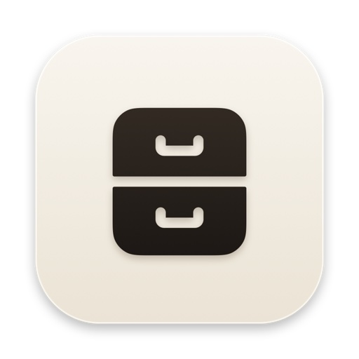
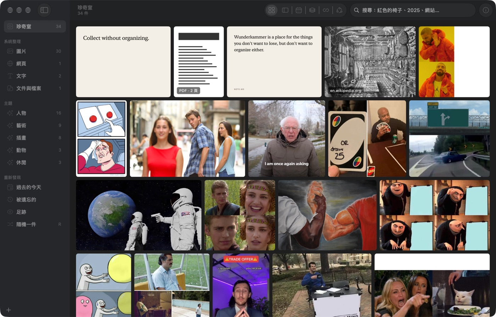

# Wunderkammer

> **Collect without organizing.**

macOS 原生的個人珍奇室。看到喜歡的東西就收進來，不用分類、命名或整理；系統負責理解、搜尋與重新發現。

<p align="center"></p>



## 收藏

| 方式 | 操作 |
|---|---|
| 全域快捷鍵 | `⌘⇧C`：剛複製的東西優先；否則收最前面瀏覽器的目前分頁 |
| 截圖 | `⌃⌘⇧C`：選範圍或視窗，截好直接收進來 |
| 拖放、貼上 | 把檔案、圖片、網址或文字拖進視窗，或按 `⌘V` |
| Dock | 把檔案拖到 Dock 上的 icon |
| 選單列 | 珍奇櫃 icon：收藏剪貼簿、截圖收藏、隨機一件 |
| 分享選單 | 任何 app 的「分享 → Wunderkammer」 |
| 服務選單 | 選取文字或檔案後，右鍵「服務 → 收進 Wunderkammer」 |
| 瀏覽器 | 擴充或書籤小程式，見 [extensions/README.md](extensions/README.md) |

收藏不會跳出任何對話框，收完在螢幕上方出現 1.6 秒的提示。關掉視窗後 app 仍在背景執行，收藏照常運作；點 Dock icon 或按 `⌘0` 叫回視窗。

能收的東西：圖片、影片、聲音、PDF、網頁、文字與任何檔案。檔案以參照方式收藏（記路徑與 bookmark），不會複製一份；只有本身沒有檔案的內容（複製的圖片、截圖）才保存在圖庫裡。

## 瀏覽

| 顯示方式 | 快捷鍵 | 說明 |
|---|---|---|
| Grid | `⌘1` | 每排填滿寬度，保留原始比例 |
| Masonry | `⌘2` | 瀑布流欄位 |
| Timeline | `⌘3` | 依收藏日期分組 |
| Canvas | `⌘4` | 自由排列：框選後拖出成新的一堆，堆與堆自動推開 |
| Infinity | `⌘5` | 無邊界的牆，閒置時會慢慢漂移 |

* 捏合或 `⌘` 加滾輪縮放；放開後以彈簧動畫重排。
* `Space` 預覽：圖片、網頁、短文字從磚塊飛出；影片、聲音、PDF、長文字與其他檔案用系統 Quick Look。
* `Return` 用預設 app 或瀏覽器打開；`⌘I` 顯示系統記下的 metadata。
* `Delete` 移除，`⌘Z` 復原。移除不會動到原始檔案。

## 找到

* `⌘K` 搜尋標題、檔名、網站、文字、圖中文字（OCR）、系統辨識的物件與顏色、收藏年份。中文查詢會斷詞並對應英文標籤，例如「紅色的椅子」。
* 語意搜尋：用描述找圖，例如「a cat at a dinner table」。需要先執行 `scripts/models/fetch-mobileclip.sh` 安裝本機模型（約 106 MB）。中文描述需要系統的「中文（繁體）→ 英文」翻譯語言，可從選單「編輯 → 啟用中文描述搜尋…」下載。
* 收藏也編入 Spotlight（只放標題、網站與主題，不放文字內容）。
* 側欄的 view 都由系統維護：依類型（圖片、網頁、文字……）、自動發現的主題（人物、插畫……）。
* 右鍵「找相似的」依視覺相似度排序；`⌘I` 列出相關的收藏，名字與網站可以點開，看所有連到它的收藏。
* Canvas 空白處右鍵「依主題分堆」：系統依主題分成有名稱的幾堆。

## 重新發現

* `R` 隨機挑一件：越久以前收、越久沒看的越容易出現，預覽下方寫著「你在 N 天前收藏了這個」。
* 側欄「過去的今天」與「被遺忘的」（超過一個月沒看）。

所有理解（OCR、物件、顏色、相似度、名字）都用 Apple Vision 與 NaturalLanguage 在本機完成，不上傳任何內容。

## 建置

需要 Xcode 16 以上與 [XcodeGen](https://github.com/yonaskolb/XcodeGen)。

```bash
xcodegen generate
scripts/build-release.sh        # 輸出 dist/Wunderkammer.app
```

簽章設定在 `Config/Signing.xcconfig`。分享延伸功能使用 App Group，需要在 `Config/Signing.local.xcconfig`（不進版控）設定開發者憑證；ad-hoc 簽章時其他功能照常運作。

## 測試

```bash
xcodebuild -project Wunderkammer.xcodeproj -scheme Wunderkammer -derivedDataPath build test
scripts/selftest.sh             # 端對端：完整流程
scripts/selftest.sh ui          # 收藏、顯示方式、搜尋、隨機、Inspector
scripts/selftest.sh understand  # OCR、主題、相似、主題分堆
scripts/selftest.sh semantic    # 語意搜尋（需要模型）
scripts/selftest.sh formats     # 系統內建的影片、聲音、HEIC、PDF、app
WK_SELFTEST_TIMEOUT=400 scripts/selftest.sh perf   # 3,000 件的效能
```

端對端測試用圖庫的複本操作 app 本身，不會動到真正的圖庫與滑鼠；截圖與紀錄在 `build/selftest/`。

## 結構

| 資料夾 | 內容 |
|---|---|
| `Wunderkammer/Model` | Curiosity 資料模型、Representation、metadata、搜尋、理解、重新發現 |
| `Wunderkammer/Capture` | 快捷鍵、剪貼簿、瀏覽器、截圖、服務、分享收件匣 |
| `Wunderkammer/Cabinet` | 五種顯示方式、預覽、側欄、Inspector |
| `Wunderkammer/DesignSystem` | Reicon icon、空狀態文字 |
| `ShareExtension` | 分享延伸功能 |
| `extensions/browser` | Chrome、Zen、Firefox 擴充 |
| `docs/DECISIONS.md` | 決策紀錄 |

圖庫位置：`~/Library/Application Support/Wunderkammer/`（`library.json`、`originals/`、`thumbnails/`、`featureprints/`、`embeddings/`、`models/`）。
