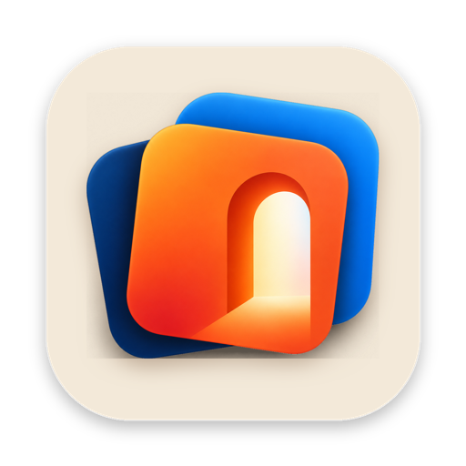
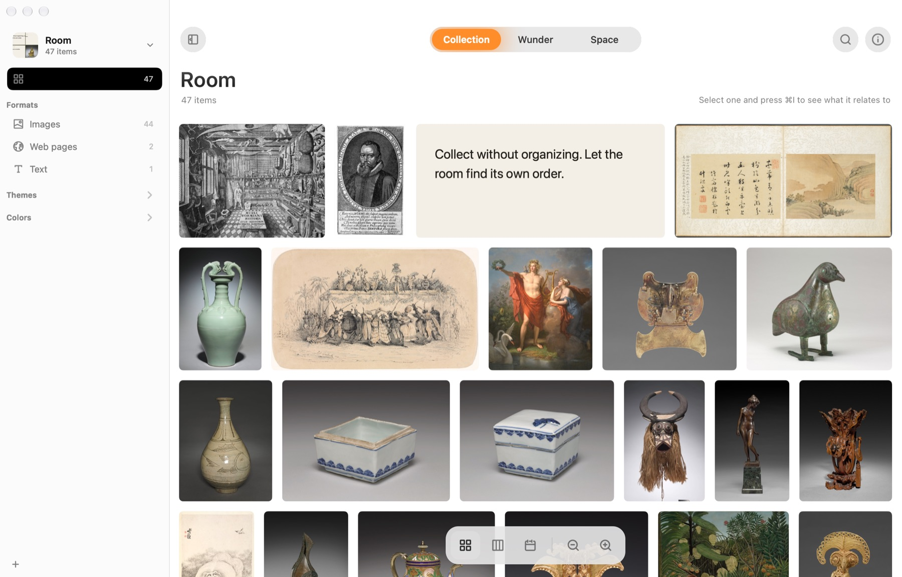

<p align="center"></p>

<h1 align="center">Wunder</h1>

<p align="center"><b>A cabinet of curiosities for your Mac. Collect anything, organize nothing.</b><br>
<a href="https://wunder.rocavence.com">wunder.rocavence.com</a> · <a href="README.zh-Hant.md">繁體中文</a></p>



Wunder keeps pictures, web pages, text and files without asking where they go. It reads the words in pictures, recognizes what's in them and their colors, and sorts itself by format, kind, theme and color. Then it brings old things back, so what you collected doesn't just sit there. Everything runs on your Mac.

## Download

[**Download Wunder.zip**](https://github.com/rocavence/Wunderkammer/releases/latest/download/Wunder.zip) (4 MB, macOS 14 or later, Apple silicon and Intel).

Wunder isn't notarized by Apple yet. The first time you open it, macOS stops it: open **System Settings → Privacy & Security**, scroll down and click **Open Anyway**. Or run:

```bash
xattr -dr com.apple.quarantine /Applications/Wunder.app
```

## Collect

| How | What to do |
|---|---|
| Shortcut | `⌘⇧C` collects what you just copied, or the page open in your browser |
| Screenshot | `⌃⌘⇧C`, then drag a region or pick a window |
| Drag and drop | Onto the window, the Dock icon, or the arch in the menu bar |
| Paste | `⌘V` in the window |
| Services | Select text or files, then right-click → Services → Collect in Wunder |
| Browser | Extension or bookmarklet, see [extensions/README.md](extensions/README.md) |
| Siri and Shortcuts | “Collect into Wunder”, “Ask Wunder”, “Search Wunder” |
| Watched folders | A room can watch up to three folders and take in what lands there |

Files stay where they are: Wunder remembers where they live and follows them if they move. A room can instead keep a copy of every file in a folder of its own.

## Three spaces

| Space | For | Layouts |
|---|---|---|
| Collection | Browsing and finding | Grid, masonry, timeline |
| Wunder | Rediscovering | A drifting wall; For Today, On this day, Forgotten, Trail, Surprise Me |
| Space | Thinking | A canvas: pile by format, kind, theme or color, connect, save three layouts |

## Find

* `⌘K` searches titles, file names, sites, text, the words inside pictures, recognized objects and colors, and the year.
* Describe a picture to find it, like “a bird on a branch”. The description model (MobileCLIP, about 106 MB) downloads the first time you need it.
* End a search with a question mark to ask your collection a question. Needs Apple Intelligence (macOS 26).
* Right-click → Find Similar; `⌘I` shows what Wunder noticed and what's related.

## Rooms and sync

Each room (展室) has its own collection, cover and folders. Turn on sync for a room and it moves into iCloud Drive, where any Mac signed in to your Apple Account can join it. When two Macs change it at once, both changes are kept.

## Privacy

Text recognition, objects, colors, similarity, description search and questions all run on your Mac with Apple's frameworks. Wunder goes online only to read the pages you collect, to download the optional description model once, and to check GitHub for a new version once a day.

## Build

Needs Xcode 16 or later and [XcodeGen](https://github.com/yonaskolb/XcodeGen).

```bash
xcodegen generate
scripts/build-release.sh     # dist/Wunder.app, signed with your local certificate
scripts/package.sh           # dist/Wunder.zip, ad-hoc signed, for download
```

Signing settings live in `Config/Signing.xcconfig`. To use your own certificate, put `CODE_SIGN_IDENTITY` and `DEVELOPMENT_TEAM` in `Config/Signing.local.xcconfig` (not tracked). The Share menu extension needs a team-signed build, so the ad-hoc download leaves it out.

## Test

```bash
xcodebuild -project Wunderkammer.xcodeproj -scheme Wunderkammer -derivedDataPath build test
scripts/selftest.sh ui           # end to end: collect, layouts, search, random, inspector
scripts/selftest.sh spaces       # the three spaces, piles, saved layouts
scripts/selftest.sh understand   # text in pictures, themes, similar (macOS's own pictures)
scripts/selftest.sh cloud        # rooms in iCloud Drive (a stand-in folder)
```

End-to-end tests drive the app itself on a copy of your library, or on built-in test pictures. They never touch your real library, your mouse or your focus. Screenshots and logs go to `build/selftest/`.

## Layout

| Folder | What's there |
|---|---|
| `Wunderkammer/Model` | Items, library, search, understanding, rediscovery, sync |
| `Wunderkammer/Capture` | Shortcuts, clipboard, browser, screenshots, services, share inbox |
| `Wunderkammer/Cabinet` | The views: grid, wall, canvas, preview, sidebar, inspector |
| `Wunderkammer/App` | App delegate, rooms, settings, menu bar, updates, self-tests |
| `ShareExtension` | The Share menu extension |
| `extensions/browser` | Chrome, Zen and Firefox extension |
| `site` | wunder.rocavence.com |
| `docs` | [PLAN.md](docs/PLAN.md) (plan and roadmap), [DECISIONS.md](docs/DECISIONS.md) (decision log), both in Chinese |

Pictures in the screenshots come from the [Cleveland Museum of Art Open Access](https://www.clevelandart.org/open-access) collection (CC0).
