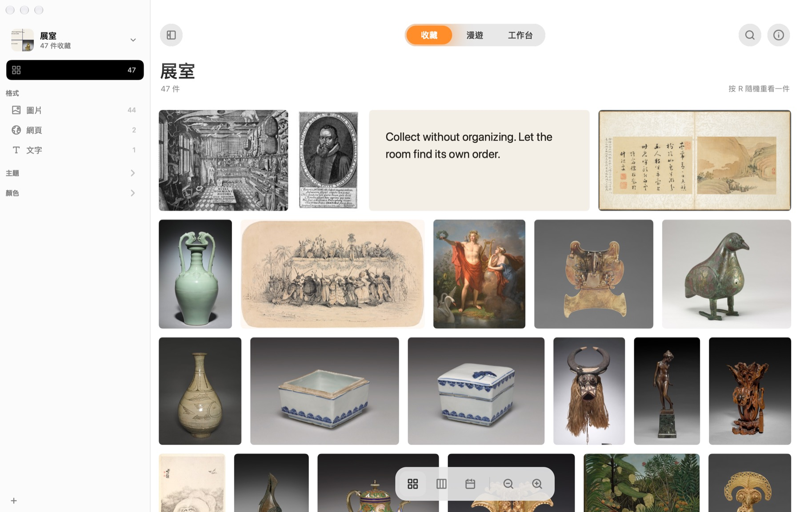

<p align="center"></p>

<h1 align="center">Wunder</h1>

<p align="center"><b>Mac 上的珍奇室。什麼都能收，什麼都不用整理。</b><br>
<a href="https://wunder.rocavence.com/zh/">wunder.rocavence.com</a> · <a href="README.md">English</a></p>



Wunder 收下圖片、網頁、文字和檔案，不問你要放哪裡。它讀得出圖裡的字，認得出拍到什麼和顏色，自己依格式、分類、主題、顏色整理好。它也會把舊東西帶回來，收過的不會就這樣躺著。所有理解都在你的 Mac 上完成。

## 下載

[**下載 Wunder.zip**](https://github.com/rocavence/Wunderkammer/releases/latest/download/Wunder.zip)（4 MB，macOS 14 以上，Apple 晶片與 Intel 都能用）。

Wunder 還沒經過 Apple 公證，第一次打開會被 macOS 擋下。打開「系統設定 → 隱私權與安全性」，往下捲，按「強制打開」。也可以在「終端機」執行：

```bash
xattr -dr com.apple.quarantine /Applications/Wunder.app
```

## 收藏

| 方式 | 操作 |
|---|---|
| 快捷鍵 | `⌘⇧C`：剛拷貝的東西優先，否則收瀏覽器目前的頁面 |
| 截圖 | `⌃⌘⇧C`，拖曳選範圍或選視窗 |
| 拖放 | 拖進視窗、Dock 圖示，或選單列的拱門 |
| 貼上 | 在視窗裡按 `⌘V` |
| 服務選單 | 選取文字或檔案後，右鍵「服務 → 收進 Wunder」 |
| 瀏覽器 | 擴充功能或書籤小程式，見 [extensions/README.md](extensions/README.md) |
| Siri 與捷徑 | 「收進 Wunder」「問 Wunder」「在 Wunder 找」 |
| 監看資料夾 | 每個展室最多監看 3 個資料夾，放進去的檔案自動收進來 |

檔案留在原處：Wunder 記得檔案在哪裡，搬走了也追得到。展室也可以改成把每個檔案複製一份到自己的資料夾。

## 三個空間

| 空間 | 用途 | 排法 |
|---|---|---|
| 收藏 | 瀏覽與尋找 | 格狀、瀑布、時間軸 |
| 漫遊 | 重新發現 | 會漂動的牆；今天的推薦、過去的今天、被遺忘的、足跡、隨機一件 |
| 工作台 | 整理想法 | 畫布：依格式、分類、主題或顏色分堆，連線，存三種排法 |

## 找到

* `⌘K` 搜尋標題、檔名、網站、文字、圖片裡的字、辨識出的物件與顏色、年份。
* 用一句話描述就能找圖，例如「樹枝上的鳥」。描述搜尋用的 MobileCLIP 模型（約 106 MB）在第一次用到時詢問後下載。
* 在搜尋框輸入問句再按 Return，就是對收藏提問。需要 Apple Intelligence（macOS 26）。
* 右鍵「找相似的」；`⌘I` 顯示 Wunder 看到的內容與相關的收藏。

## 展室與同步

每個展室有自己的收藏、封面和資料夾。在展室打開同步，它會搬進 iCloud 雲碟，同一個 Apple 帳號的 Mac 都能加入。兩台 Mac 同時修改時，兩邊的修改都會留下。

## 隱私

圖中文字、物件、顏色、相似、描述搜尋與提問，全部用 Apple 的框架在你的 Mac 上執行。Wunder 只有三種時候會連網：讀取你收的網頁、下載一次描述搜尋模型（可以不裝），以及每天向 GitHub 確認一次有沒有新版本。

## 建置

需要 Xcode 16 以上與 [XcodeGen](https://github.com/yonaskolb/XcodeGen)。

```bash
xcodegen generate
scripts/build-release.sh     # dist/Wunder.app，用本機憑證簽章
scripts/package.sh           # dist/Wunder.zip，ad-hoc 簽章的下載版
```

簽章設定在 `Config/Signing.xcconfig`。要用自己的憑證，在 `Config/Signing.local.xcconfig`（不進版控）設定 `CODE_SIGN_IDENTITY` 與 `DEVELOPMENT_TEAM`。分享選單的延伸功能需要團隊簽章，所以 ad-hoc 下載版不包含它。

## 測試

```bash
xcodebuild -project Wunderkammer.xcodeproj -scheme Wunderkammer -derivedDataPath build test
scripts/selftest.sh ui           # 端對端：收藏、排法、搜尋、隨機、資訊側欄
scripts/selftest.sh spaces       # 三個空間、分堆、儲存的排列
scripts/selftest.sh understand   # 圖中文字、主題、相似（macOS 內建圖片）
scripts/selftest.sh cloud        # iCloud 雲碟裡的展室（用替代資料夾）
```

端對端測試用圖庫的複本或內建的測試圖片操作 app 本身，不會動到真正的圖庫、滑鼠或目前的視窗。截圖與紀錄在 `build/selftest/`。

## 結構

| 資料夾 | 內容 |
|---|---|
| `Wunderkammer/Model` | 收藏、圖庫、搜尋、理解、重新發現、同步 |
| `Wunderkammer/Capture` | 快捷鍵、剪貼簿、瀏覽器、截圖、服務選單、分享收件匣 |
| `Wunderkammer/Cabinet` | 各種檢視：格狀、收藏牆、畫布、預覽、側欄、資訊側欄 |
| `Wunderkammer/App` | App 主程式、展室、設定、選單列、更新、自我測試 |
| `ShareExtension` | 分享選單延伸功能 |
| `extensions/browser` | Chrome、Zen、Firefox 擴充功能 |
| `site` | wunder.rocavence.com 網站 |
| `docs` | [PLAN.md](docs/PLAN.md)（計畫書與 roadmap）、[DECISIONS.md](docs/DECISIONS.md)（決策紀錄） |

截圖裡的圖片來自[克里夫蘭美術館 Open Access](https://www.clevelandart.org/open-access)（CC0）。
